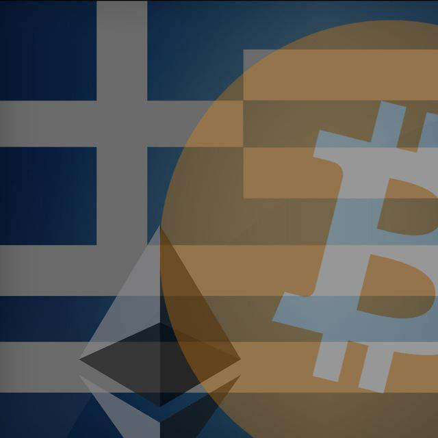

# Greek Crypto Currency Community

 

# Κανόνες της κοινότητας:

1) Αυτός ο διαδικτυακός τόπος και το περιεχόμενό του έχουν καθαρά ενημερωτικό χαρακτήρα και δεν συνιστούν, ούτε μπορούν να εκληφθούν ως παρότρυνση, προτροπή, προσφορά ή συμμετοχή για οποιαδήποτε επενδυτική πράξη ή  επενδυτική συμβουλή. Ο κάθε χρήστης οφείλει να προβαίνει στην διεξαγωγή καθαρά προσωπικής του έρευνας ως προς το περιεχόμενο των δημοσιεύσεων της κοινότητας, να δρα με δική του βούληση και να αναλαμβάνει εξολοκλήρου την ευθύνη για τις ενδεχόμενες ενέργειες τις οποίες θα προβεί βάσει αυτών των δημοσιεύσεων. 
2) Το group έχει αποκλειστικό σκοπό την ανταλλαγή απόψεων μεταξύ των μελών για τα κρυπτονομίσματα και την τεχνολογία blockchain. 
3) Απαγορεύονται αυστηρά οι σύνδεσμοι με referral codes και η προώθηση επενδυτικών προϊόντων ή υπηρεσιών. 
4) Διατηρούμε την συζήτηση γύρω από τα κρυπτό νομίσματα, με σεβασμό στην τεχνολογία Blockchain και ό,τι αυτή πρεσβεύει.
5) Απαγορεύονται αυστηρά τα υβριστικά σχόλια και κάθε είδους πρόκληση φόβου, αβεβαιότητας και αμφιβολίας (FUD).
6) Σε περίπτωση που υποπέσει στην αντίληψη των διαχειριστών η συμμετοχή ατόμων κάτω των δεκαοκτώ (18) ετών ή υπάρχει παράβαση των παραπάνω κανόνων, οι διαχειρηστές προβαίνουν άμεσα σε κάθε εύλογη ενέργεια με σκοπό την αποβολή των εν λόγω χρηστών.
